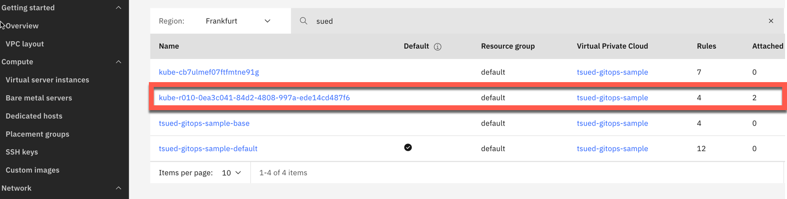

# Use IasCable to create a VPC and a Red Hat OpenShift cluster with Argo CD installed on IBM Cloud

Our objective is to create a customized initial setup in an [`IBM Cloud`](https://cloud.ibm.com/login) environment for [GitOps](https://www.ibm.com/garage/method/practices/run/gitops/).

The [`Software Everywhere`](https://github.com/cloud-native-toolkit/software-everywhere) project and [`IasCable`](https://github.com/cloud-native-toolkit/iascable) CLI do provide an awesome way to eliminate writing [`Terraform`](https://www.terraform.io/) modules for various clouds such as [`IBM Cloud`](https://cloud.ibm.com/login), [`AWS`](https://aws.amazon.com/) or [`Azure`](https://azure.microsoft.com/) to create and configure resources. We are going to reuse Terraform modules which the [`Software Everywhere` catalog](https://modules.cloudnativetoolkit.dev/) does provide.

Surely, we need to know the needed outline for the cloud architecture which does depend on the cloud environment we are going to use.

As I said the [`Software Everywhere` catalog](https://modules.cloudnativetoolkit.dev/) does provide  the reuse of existing Terraform modules, which we use by just combining by writing a ["`Bill of Material file`"](https://github.com/cloud-native-toolkit/iascable) and configure the variables for the related Terraform modules ([example link to the GitOps Terraform module](https://github.com/cloud-native-toolkit/terraform-gitops-cp-bas)) when it is needed.

> We **will not write any Terraform code**, we will only combine existing Terraform modules and configure them using [IasCable `BOM`](https://github.com/cloud-native-toolkit/iascable) files!

In that scenario we will use [`IBM Cloud`](https://cloud.ibm.com/login) with a [`Virtual Private Cloud`](https://www.ibm.com/cloud/learn/vpc) and a [`Red Hat OpenShift cluster`](https://www.ibm.com/cloud/openshift) with [`Argo CD installed`](https://github.com/redhat-developer/gitops-operator) and integrated with a GitHub project.

These are the major sections:

1. Define an outline of the target architecture
2. Identify the needed `Software Everywhere` Terraform modules for the target outline
3. Write a customized `BOM` to combine the modules
4. Use `IasCable` to create the scaffolding for a `IasCable` project
5. Use a tools container to execute the Terraform modules in the scaffolding project outline of the `IasCable` project
  > Note: Depending on the container runtime you are going to use on your computer, you maybe have to copy the `IasCable` project inside the running container, because of access right restrictions to access mapped local volumes to the running containers. That is reason why I wrote some helper scripts to simplify the copy and deletion of the resource mapped to a local volume in the current [GitHub project](https://github.com/thomassuedbroecker/iascable-vpc-openshift-argocd/tree/main/example).
6. Apply the Terraform modules to create the environment in IBM Cloud and backup the [Terraform state](https://www.terraform.io/language/state) to the local computer.
7. Destroy the environment on IBM Cloud.
8. Summary

## 1. Define an outline of the target architecture

This is our simplified target architecture for our objective to create a customized setup in an IBM Cloud environment for GitOps.

* Configuration of `GitOps` in `Red Hat OpenShift`
  
  We will use two operators: 
  * [Red at OpenShift GitOps operator](https://github.com/redhat-developer/gitops-operator)

    * We will create one [ArgoCD instance](https://argo-cd.readthedocs.io/en/stable/) with the [Red at OpenShift GitOps operator](https://github.com/redhat-developer/gitops-operator) operator, that [ArgoCD instance](https://argo-cd.readthedocs.io/en/stable/) will bin initial configured by a newly created GitHub project configure by a [Cloud Native Toolkit template](https://github.com/cloud-native-toolkit/terraform-tools-gitops/tree/main/template) for GitOps repositories.

  * [Red at OpenShift Pipelines operator](https://catalog.redhat.com/software/operators/detail/5ec54a4628834587a6b85ca5). 

    * There will be no initial setup for a [Tekton pipeline](https://tekton.dev/docs/pipelines/pipelines/) at the moment.

  

* `IBM Cloud infrastructure` with `Red Hat OpenShift` in a `Virtual Private Cloud` 

  

## 2. Identify the needed `Software Everywhere` Terraform modules for the target outline

Let us first define which `Software Everywhere` 
Terraform modules we are going to use for own custom `BOM`. [`Software Everywhere`](https://github.com/cloud-native-toolkit/software-everywhere) project points to the  [Automated Solutions project](https://github.com/cloud-native-toolkit/automation-solutions) which contains several starting points for various setups.

In our case we have to major areas for `Terraform` modules we want to use:

1. `Configuration of GitOps`
2. `IBM Cloud infrastructure`

### 1. Configuration of GitOps 

  * [IBM OpenShift login `ocp-login`](https://github.com/cloud-native-toolkit/terraform-ocp-login) - login to existing OpenShift cluster
  * [GitOps repo `gitops-repo`](https://github.com/cloud-native-toolkit/terraform-tools-gitops) - creates the GitOps Repo
  * [ArgoCD Bootstrap `argocd-bootstrap`](https://github.com/cloud-native-toolkit/terraform-tools-gitops)

  
### 2. Cloud infrastructure/services resources related 

  * [IBM VPC `ibm-vpc`](https://github.com/cloud-native-toolkit/terraform-ibm-vpc)
  * [IBM VPC Subnets `ibm-vpc-subnets`](https://github.com/cloud-native-toolkit/terraform-ibm-vpc-subnets)
  * [IBM Cloud VPC Public Gateway `ibm-vpc-gateways`](https://github.com/cloud-native-toolkit/terraform-ibm-vpc-gateways)
  * [IBM OpenShift VPC cluster `ibm-ocp-vpc`](https://github.com/cloud-native-toolkit/terraform-ibm-ocp-vpc)
  * [IBM Object Storage `ibm-object-storage`](https://github.com/cloud-native-toolkit/terraform-ibm-object-storage)

## 3. Write a customized `BOM` to combine the modules

### Step 1: Write the Bill of Material `BOM` file

Combine Terraform modules and define some variables in the initial `BOM` file.

> Note: When we going to use variables, we must keep in mind that we must use the name of the variables defined in the Terraform modules and use `alias: ibm-vpc` to define the prefix.

The `BOM` is divided in 3 main sections.

* Virtual Private Cloud
* Red Hat OpenShift Cluster (ROKS)
* GitOps

```yaml
apiVersion: cloudnativetoolkit.dev/v1alpha1
kind: BillOfMaterial
metadata:
  name: my-ibm-vpc-roks-argocd
spec:
  modules:
    # Virtual Private Cloud - related
    # - subnets
    # - gateways
    - name: ibm-vpc
      alias: ibm-vpc
      version: v1.16.0
      variables:
      - name: name
        value: "tsued-gitops-sample"
      - name: tags
        value: ["tsuedro"]
    - name: ibm-vpc-subnets
      alias: ibm-vpc-subnets
      version: v1.13.2
      variables:
        - name: _count
          value: 1
        - name: name
          value: "tsued-gitops-sample"
        - name: tags
          value: ["tsuedro"]
    - name: ibm-vpc-gateways
    # ROKS - related
    # - objectstorage
    - name: ibm-ocp-vpc
      alias: ibm-ocp-vpc
      version: v1.15.5
      variables:
        - name: name
          value: "tsued-gitops"
        - name: worker_count
          value: 2
        - name: tags
          value: ["tsuedro"]
    - name: ibm-object-storage
      alias: ibm-object-storage
      version: v4.0.3
      variables:
        - name: name
          value: "cos_tsued_gitops"
        - name: tags
          value: ["tsuedro"]
        - name: label
          value: ["cos_tsued"]
    # Install OpenShift GitOps and Bootstrap GitOps (aka. ArgoCD) - related
    # - argocd
    # - gitops
    - name: argocd-bootstrap
      alias: argocd-bootstrap
      version: v1.12.0
      variables:
        - name: repo_token
    - name: gitops-repo
      alias: gitops-repo
      version: v1.20.2
      variables:
        - name: host
          value: "github.com"
        - name: type
          value: "GIT"
        - name: org
          value: "thomassuedbroecker"
        - name: username
          value: "thomassuedbroecker"
        - name: project
          value: "iascable-gitops"
        - name: repo
          value: "iascable-gitops"
```

## 4. Use `IasCable` to create the scaffolding for a `IasCable` project

### Step 1: Install [colima](https://github.com/abiosoft/colima) container engine and start the container engine

Example for an installation on macOS.

```sh
brew install docker colima
colima start
```

### Step 2: Build the project based on Bill of Material `BOM` file

* **Version**

```sh
iascable --version
```

* Output:

```sh
2.14.1
```

* **Build**

```sh
iascable build -i my-vpc-roks-argocd-bom.yaml
```

* Output:

```sh
Loading catalog from url: https://modules.cloudnativetoolkit.dev/index.yaml
Name: my-ibm-vpc-roks-argocd
Writing output to: ./output
```


### Step 3: Copy helper bash scripts into the output folder

```sh
cp helper-tools-create-container-workspace.sh ./output
cp helper-tools-execute-apply-and-backup-result.sh ./output
cp helper-tools-execute-destroy-and-delete-backup.sh ./output
```

### Step 4: Start the tools container provided by the `IasCable`

> Note: At the moment we need to touch the `launch.sh` script.

1. Open the `launch.sh` script.

```sh
cd output
nano launch.sh
```

2. Delete the `-u "${UID}"` parameter

* Before

```sh
${DOCKER_CMD} run -itd --name ${CONTAINER_NAME}    -u "${UID}"    -v "${SRC_DIR}:/terraform"    -v "workspace-${AUTOMATION_BASE}:/workspaces"    ${ENV_FILE}    -w /terraform    ${DOCKER_IMAGE}
```

* After the change

```sh
${DOCKER_CMD} run -itd --name ${CONTAINER_NAME} -v "${SRC_DIR}:/terraform"    -v "workspace-${AUTOMATION_BASE}:/workspaces"    ${ENV_FILE}    -w /terraform    ${DOCKER_IMAGE}
```

3. Execute the `launch.sh` script

```sh
sh launch.sh
```

## 5. Use a tools container to execute the Terraform modules in the scaffolding project outline of the `IasCable` project

### Step 1 (inside the container): In the running container verify the mapped resources 

```sh
~/src $ ls
helper-tools-create-container-workspace.sh
helper-tools-execute-apply-and-backup-result.sh
helper-tools-execute-destroy-and-delete-backup.sh
launch.sh
my-ibm-vpc-roks-argocd
```

### Step 2 (inside the container): Create a workspace folder in your container and copy your `IasCable` project into it

All these tasks are automated in the helper bash script I wrote.

```sh
sh helper-tools-create-container-workspace.sh
ls /workspaces
```

* Output:

You can see the copied `IasCable` project folder inside the container.

```sh
my-ibm-vpc-roks-argocd
```

## 6. Apply the Terraform modules to create the environment in IBM Cloud and backup Terraform configuration 

### Step 1 (inside the container): Execute the `apply.sh` and backup the result into the mapped volume

All these tasks are automated in the helper bash script I wrote.

```sh
sh helper-tools-execute-apply-and-backup-result.sh
```

* The scipt [helper-tools-execute-apply-and-backup-result.sh](https://github.com/thomassuedbroecker/iascable-vpc-openshift-argocd/blob/main/example/helper-tools-execute-apply-and-backup-result.sh) does following:

  1. Navigates to the create workspace
  2. Execute `apply.sh` script
  3. List the created resources
  4. Copy current start to mapped volume

* Interactive output:

As we see in the output the values we inserted in our custom `BOM` file are now used as the default values.

```sh
Variables can be provided in a yaml file passed as the first argument

Provide a value for 'gitops-repo_host':
  The host for the git repository. The git host used can be a GitHub, GitHub Enterprise, Gitlab, Bitbucket, Gitea or Azure DevOps server. If the host is null assumes in-cluster Gitea instance will be used.
> (github.com) 
Provide a value for 'gitops-repo_org':
  The org/group where the git repository exists/will be provisioned. If the value is left blank then the username org will be used.
> (thomassuedbroecker) 
Provide a value for 'gitops-repo_project':
  The project that will be used for the git repo. (Primarily used for Azure DevOps repos)
> (iascable-gitops)
Provide a value for 'gitops-repo_username':
  The username of the user with access to the repository
> (thomassuedbroecker) 
Provide a value for 'gitops-repo_token':
  The personal access token used to access the repository
> 
> Provide a value for 'ibmcloud_api_key':
> XXX
Provide a value for 'region':
> eu-de
Provide a value for 'worker_count':
  The number of worker nodes that should be provisioned for classic infrastructure
> (2)
Provide a value for 'ibm-ocp-vpc_flavor':
  The machine type that will be provisioned for classic infrastructure
> (bx2.4x16) 
Provide a value for 'ibm-vpc-subnets__count':
  The number of subnets that should be provisioned
> (1) 
Provide a value for 'resource_group_name':
  The name of the resource group
> default
```

* Output:

Move on with the setup and apply Terraform.

```sh
Do you want to perform these actions?
  Terraform will perform the actions described above.
  Only 'yes' will be accepted to approve.

  Enter a value: yes
```

After a while you should get following output.

```sh
Apply complete! Resources: 91 added, 0 changed, 0 destroyed.
```

* Major resources which were created:
 
  * Cloud infrastructure/services resources

    * 1 x VPC
      
    * 1 x Subnet
      
    * 4 Security groups
      Two were created during the subnet creation and two are related to the created Red Hat OpenShift cluster.
      
    * 1 x Virtual Private Endpoint
      
    * 1 x Public Gateway
      
    * 2 x Access Control Lists
      One was created for the VPC module and one during the creation by the subnet module.
      
    * 1 x Routing Table
      
    * 1 x Red Hat OpenShift Cluster
      
    * 1 x Object Storage
      
  
  * Cluster and GitOps configuration

     * `Red Hat OpenShift GitOps` operator and `Red Hat OpenShift Pipelines`  operator
      
    * `GitHub` project as ArgoCD repository
      
    * Preconfigure ArgoCD project
      
      
The invoked `apply.sh` script will create:

* a temporary `workspace/my-ibm-vpc-roks-argocd/variables.yaml.tmp` file
* a `workspace/my-ibm-vpc-roks-argocd/variables.yaml` file
* a `workspace/my-ibm-vpc-roks-argocd/terraform/variables.tf` file
* a `workspace/my-ibm-vpc-roks-argocd/terraform/variables.tfvars` file
* several folders `.kube`, `.terraform`, `.tmp`, `bin2`, `docs`
* it creates a GitHub private project which contains you ID for the `cloud native toolkit`

> Note: Here you can sample of the content of an example for a generated variables.yaml file [link](/overview-variables.md) and here you can find a example for the created [BOM file](/example/example-auto-created-bom-file.yaml).

* Then it creates a `terraform.tfvars` file based on the entries you gave and executes init and apply command from Terraform.


> Be aware the `key information` is saved in text format in the `output/my-ibm-vpc-roks-argocd/terraform/terraform.tfvars` file! 


## 7. Destroy the environment on IBM Cloud

### Step 1 (inside the container): Destory create resources

> Note: Ensure you didn't delete created files before.
 
```sh
sh helper-tools-execute-destroy-and-delete-backup.sh
```

* Output:

It also deleted the created private GitHub project.

```sh
Destroy complete! Resources: 91 destroyed.
```

## 8. Summary

We achived what we wanted to achived, create a customized initial setup in an [`IBM Cloud`](https://cloud.ibm.com/login) environment for [GitOps](https://www.ibm.com/garage/method/practices/run/gitops/). 

The [`Software Everywhere`](https://github.com/cloud-native-toolkit/software-everywhere) project and [`IasCable`](https://github.com/cloud-native-toolkit/iascable) are powerful.

> As we have see there was no need to write any Terraform module!

Yes, when you are going to define you own "Bill of Material `BOM`" you need to get familiar with the related modules related to your target architeture, when you want to customize it to your needs. 

But, as I said: There was no need to write own Terraform modules in our case.

The [`Software Everywhere`](https://github.com/cloud-native-toolkit/software-everywhere) project and [`IasCable`](https://github.com/cloud-native-toolkit/iascable) project needs some more documentation in the future, I like the power of it and it is under [Apache-2.0 license](https://github.com/cloud-native-toolkit/software-everywhere/blob/main/LICENSE), which means you can use it as your starting point or contribute.


